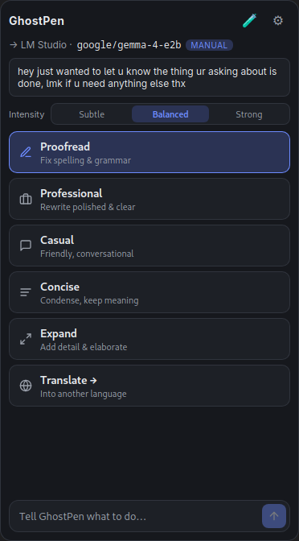
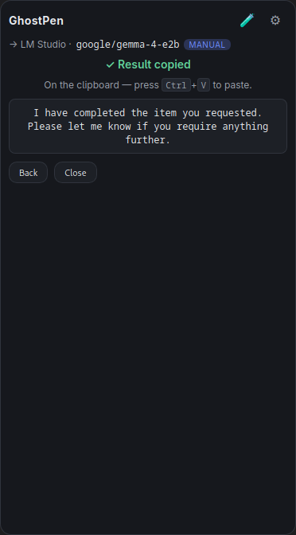
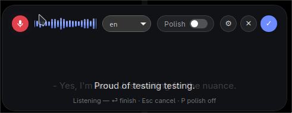

<div align="center">


# GhostPen

**AI-driven text editing, anywhere on your desktop.**

</div>

A cross-platform desktop app for AI-driven text editing. Highlight text anywhere, trigger
GhostPen, pick an action (proofread, rewrite, translate, …), and the result is pasted back
in place — or transform text directly in the built-in **Playground**. GhostPen can also
**pull the text out of an image** on your clipboard, so you can proofread, translate, or just
grab a screenshot's text with no manual retyping.

GhostPen talks to **any OpenAI-compatible `/chat/completions` endpoint** (Ollama, OpenAI,
OpenRouter, Groq, LM Studio, or a custom endpoint). The default, zero-config setup runs a
**local Ollama** instance, so your text never leaves your machine.

Built with **Tauri v2** (Rust backend + React/TypeScript frontend).

> Design docs: [`.agents/plan.md`](./.agents/plan.md) (implementation plan),
> [`.agents/architecture.md`](./.agents/architecture.md) (architecture + ADRs),
> [`.agents/TODO.md`](./.agents/TODO.md) (build status).

---

## Screenshots

Pick an action for the highlighted text (left); the result is rewritten and copied back (right):

<p align="center">
  
  &nbsp;&nbsp;&nbsp;
  
</p>

The **Professional** preset turns a casual note —
*"hey just wanted to let u know the thing ur asking about is done, lmk if u need anything else thx"* —
into *"I have completed the item you requested. Please let me know if you require anything further."*

Voice **dictation**: speak into the pill overlay, watch the live waveform and transcript, then
press ⏎ to proofread and copy the polished text to the clipboard:

<p align="center">
  
</p>

---

## Features

- **Rewrite actions:** Proofread · Professional · Casual · Concise · Expand · Translate (12 languages).
- **Intensity levels:** a global **Subtle / Balanced / Strong** control tunes how far the
  tone/length actions go (Professional, Casual, Concise, Expand).
- **Image text extraction (OCR):** copy an image, trigger GhostPen, and **Extract Text** reads
  the text out of it through your usual endpoint — then run any action on the result or copy the
  whole thing with `Ctrl+C`. Uses a **vision-capable model** (the default `gemma4:e4b` is
  multimodal); no separate OCR engine. See [Usage](#image-text-extraction-ocr).
- **Custom actions:** define your own action with a custom prompt and optional per-action
  model override — it shows up in the menu and Playground.
- **Playground:** a window to type/paste text, run any action, and watch the result **stream
  in live** — no clipboard needed.
- **Configurable backends:** multiple AI **profiles** (provider, base URL, API key, model,
  temperature); switch the active one anytime. Built-in presets + `GET /models` discovery.
- **Clipboard-safe:** your original clipboard is snapshotted before the operation and
  restored afterward.
- **Cross-platform input:** native global hotkey + synthetic copy/paste on Windows/macOS/X11;
  a **manual-copy mode** fallback where synthetic input isn't available (e.g. Wayland).
- **System tray** (where supported): Show menu · Captions · Playground · Settings · Quit.
- **Live captions (opt-in):** caption & translate **system audio** on-device with Whisper in a
  click-through overlay — with optional **GPU acceleration** (CUDA / Vulkan / Metal). See below.

---

## Prerequisites

### 1. Build toolchain

- **Rust** (stable) and **Node.js** (LTS) — install Rust via [rustup](https://rustup.rs) and
  Node from [nodejs.org](https://nodejs.org).
- **System libraries** (webkit, appindicator, xdo, …): use the cross-platform installer,
  which detects your OS/distro and installs the right packages:
  ```bash
  ./scripts/install-deps.sh            # apt / pacman / dnf / zypper / apk / macOS
  ./scripts/install-deps.sh --dry-run  # preview without installing
  ```
  It does **not** install Rust/Node (it checks for them and prints how to get them). For the
  manual list, see the [Tauri prerequisites](https://v2.tauri.app/start/prerequisites/).

### 2. An AI backend

**Default — Ollama (local, recommended).** GhostPen's default profile points at a local
Ollama server. Install Ollama and pull a model:

| Platform | Install Ollama |
|----------|----------------|
| **macOS** | App from <https://ollama.com/download>, or `brew install ollama` |
| **Linux** | `curl -fsSL https://ollama.com/install.sh \| sh` |
| **Windows** | Installer from <https://ollama.com/download> |

```bash
ollama pull gemma4:e4b        # the shipped default model
ollama run gemma4:e4b "hi"    # verify it works
```

Ollama listens on `http://localhost:11434`, which matches GhostPen's built-in Ollama profile
(`http://localhost:11434/v1`). No API key required. To use a different model, pull it and
select it in **Settings → Model** (the **Fetch models** button lists what's available).

> **No local GPU?** Use an [Ollama Cloud](https://ollama.com) model such as
> `gemma4:31b-cloud` (runs server-side, same local endpoint), or any cloud provider below.

**Other backends (optional)** — no install needed, just configure in **Settings**:

| Provider   | Base URL                          | API key |
|------------|-----------------------------------|:-------:|
| OpenAI     | `https://api.openai.com/v1`       | yes     |
| OpenRouter | `https://openrouter.ai/api/v1`    | yes     |
| Groq       | `https://api.groq.com/openai/v1`  | yes     |
| LM Studio  | `http://localhost:1234/v1`        | no      |

---

## Build & run

```bash
git clone <repo-url> ghostpen && cd ghostpen
./scripts/install-deps.sh      # system libraries
npm install                    # JS dependencies

npm run tauri dev              # run in development (hot reload)
npm run tauri build            # production bundles → src-tauri/target/release/bundle/
npm run bundle:appimage        # AppImage only (sets NO_STRIP — see note below)
```

> **Arch Linux / AppImage:** the `linuxdeploy` tool bundled by Tauri ships an old `strip`
> that can't parse the `.relr.dyn` section (`unknown type [0x13]`) in libraries built with
> Arch's current toolchain, so `tauri build`/`tauri bundle` fails with
> `failed to run linuxdeploy`. The release binary is already stripped, so just skip
> linuxdeploy's strip pass with `NO_STRIP=true` (use `npm run bundle:appimage`, or prefix
> any bundle command: `NO_STRIP=true npm run tauri build`).

Run the backend tests with:

```bash
cargo test --manifest-path src-tauri/Cargo.toml
```

---

## Usage

### Triggering the menu

- **Windows / macOS / Linux (X11):** select text in any app and press the global hotkey
  (default **`Ctrl + Shift + A`**). This, plus the **Dictation** (`Ctrl+Shift+D`) and
  **Live captions** (`Ctrl+Shift+L`) shortcuts, are configurable in **Settings → Behaviour →
  Keyboard shortcuts** (blank = unbound). On **macOS**, grant **Accessibility** permission
  first (System Settings → Privacy & Security → Accessibility), or input simulation silently
  fails.
- **Linux (Wayland / Hyprland):** in-process global hotkeys aren't allowed; bind a key in
  your compositor to launch GhostPen with `--trigger` (single-instance forwards it to the
  running app), and autostart the daemon. See [`.agents/plan.md` §10](./.agents/plan.md) for
  the exact Hyprland snippets. Without synthetic input, GhostPen runs in **manual-copy mode**:
  copy your text (Ctrl+C) first, pick an action, then paste the result (Ctrl+V).

### CLI flags

A second launch with a flag is forwarded into the running instance (no new process):

```bash
ghostpen --trigger      # show the action menu
ghostpen --voice-input  # toggle voice dictation (start / stop, result on the clipboard)
ghostpen --captions     # toggle live captions (start & show / stop & hide)
ghostpen --playground   # open the Playground window
ghostpen --settings     # open the Settings window
ghostpen --tray         # background tray only (the default; explicit for autostart)
```

A bare `ghostpen &` starts in the background with the menu hidden; it only appears when
you trigger it. `--tray` is the same thing made explicit, handy in `.desktop`/autostart
entries.

### Voice dictation (requires a captions-enabled build)

Press your dictation keybind (or tray → **Dictation**) and speak — an Apple-style pill
overlay shows a live waveform and the transcript as whisper hears you. Press the keybind
again (or **⏎** / **✓** / the 🎤 badge) to finish: the transcript gets a final whisper pass,
is **proofread by your AI profile**, and the polished text is shown in the pill and **copied
to the clipboard** — review it, then paste with **Ctrl+V**. **Esc** cancels; click 🎤 to
dictate again. Dictation uses the **same whisper model as Live Captions** (Settings →
Captions), so the model is downloaded once for both.

On Hyprland, bind it next to the trigger:

```conf
bind = CTRL SHIFT, D, exec, ghostpen --voice-input
```

### Actions & intensity

Pick an action from the menu or Playground. The **Intensity** control (Subtle / Balanced /
Strong) applies to Professional, Casual, Concise, and Expand. Proofread and Translate ignore
it. **Translate** opens a language submenu.

### Image text extraction (OCR)

When your clipboard holds an **image** instead of text, the menu switches to a focused image
view: a preview and a single **Extract Text** action (the rewrite grid, intensity, and prompt
bar are hidden). Copy an image — a screenshot, a browser **Copy image**, or a file-manager copy
— trigger GhostPen, and press **Enter** (or click **Extract Text**). GhostPen sends the image to
your active AI profile, and the recognised text becomes the working selection. From there you can:

- run any action on it (Proofread, Translate, Concise, a custom action, …), or
- copy the **whole** extracted text with **`Ctrl+C`** (shows *Copied ✓*) and paste it with **Ctrl+V**.

This reuses the same OpenAI-compatible endpoint as everything else, so it needs a
**vision-capable (multimodal) model**:

- **Ollama:** the default `gemma4:e4b` is multimodal — it just works. Other vision models (e.g.
  `gemma4:31b-cloud`) work too; pick one in **Settings → Model**.
- **LM Studio / llama.cpp:** load the model **together with its `mmproj` projector**, or the
  server returns *"image input is not supported"* and extraction fails with a readable hint.

Tune it in **Settings → Image Text Extraction (OCR)**: the max image dimension (images are
downscaled before sending, default 1024 px), the OCR system prompt, and an optional OCR-only
model override (handy if your everyday text model isn't multimodal). The image is sent to
whatever your active profile points at — which may be a cloud endpoint; with the default local
Ollama it never leaves your machine.

### Playground

Open with the **🧪** button (or `--playground`). Type or paste text, choose an intensity and
an action, and the result streams in live. Use **Copy result**, **Use as input** (to chain
transforms), or **Clear**.

### Custom actions

**Settings → Custom Actions → + Add.** Give it a label and a system prompt (e.g. *"Convert
the text into concise bullet points. Return ONLY the bullets."*), optionally a model
override. It appears alongside the built-in actions in the menu and Playground.

### Live captions (system audio) — opt-in build

GhostPen can caption and translate **system audio** (meetings, videos, podcasts) live: it
captures what you hear, transcribes it **on-device** with Whisper, and shows subtitles in a
transparent, click-through overlay — optionally translating via your active AI profile.

This pulls in heavier native dependencies (audio capture via cpal + a bundled whisper.cpp), so
it's behind the optional **`captions`** Cargo feature and **off by default**. Build deps:

| OS | Captions build dependencies |
|----|-----------------------------|
| **Linux** | ALSA dev headers + a C/C++ toolchain + libclang — `sudo apt-get install libasound2-dev clang libclang-dev cmake` (Debian/Ubuntu) / `sudo pacman -S alsa-lib clang cmake` (Arch) |
| **macOS** | Xcode command-line tools + CMake (`brew install cmake`) |
| **Windows** | LLVM/libclang + CMake (e.g. `choco install llvm cmake`) |

#### Easiest: the auto-detecting dev wrapper

`npm run tauri dev` / `npm run bundle*` go through [`scripts/tauri.mjs`](./scripts/tauri.mjs),
which **auto-enables captions when the build deps are present** — so on a properly set-up
machine you don't pass any flag at all:

```bash
npm run tauri dev          # prints e.g. "[tauri] captions: captions-cuda — CUDA auto-detected (…)"
```

It also **auto-selects the fastest whisper backend it can build** (see GPU section below), and
builds CPU-only (or no captions) where the deps/GPU aren't available — so the same command
works on every machine. Override with environment variables:

| Variable | Values | Effect |
|----------|--------|--------|
| `GHOSTPEN_CAPTIONS` | `1` / `0` | Force the captions feature on / off (skip dep auto-detect) |
| `GHOSTPEN_CAPTIONS_GPU` | `cuda` / `vulkan` / `cpu` / `auto` | Pin the whisper backend (default `auto`) |

#### Manual / explicit feature flags

```bash
npm run tauri build -- --features captions          # CPU backend (universal)
npm run tauri build -- --features captions-vulkan   # GPU, any vendor (NVIDIA/AMD/Intel)
npm run tauri build -- --features captions-cuda     # GPU, NVIDIA only (fastest)
npm run tauri build -- --features captions-metal    # GPU, macOS (Apple Silicon / Metal)
# or with cargo directly: cargo run --features captions-vulkan
```

### GPU-accelerated transcription

whisper.cpp runs on the **CPU** by default. On a GPU it's dramatically faster — fast enough to
run a larger, more accurate model (`small`/`medium`) in real time instead of being stuck on
`tiny`. GhostPen exposes three GPU backends as Cargo features, each implying `captions`:

| Backend | Feature | Runs on | Build needs | Notes |
|---------|---------|---------|-------------|-------|
| **CUDA** | `captions-cuda` | NVIDIA only | CUDA toolkit (`nvcc`) + NVIDIA driver | Fastest; binary requires an NVIDIA GPU at runtime |
| **Vulkan** | `captions-vulkan` | NVIDIA / AMD / Intel | `glslc`/shaderc + Vulkan loader & headers | One binary for any GPU vendor; CPU fallback if no GPU |
| **Metal** | `captions-metal` | macOS GPU | Xcode (built in) | Apple Silicon / Intel-Mac GPU; CPU fallback |
| CPU | `captions` | everything | — | Universal fallback, no GPU needed |

A GPU build is **not universal** — it links a vendor runtime and needs that hardware/driver to
run (a CUDA binary won't start without an NVIDIA GPU). Pick the feature matching the machine
you'll *run* on, or just use the auto-detecting wrapper above.

#### Building locally with CUDA (NVIDIA)

If you have an NVIDIA GPU and want maximum speed (this is the maintainer's dev setup — RTX 4070):

1. Install the **NVIDIA driver** and the **CUDA toolkit** (provides `nvcc`):
   - Arch: `sudo pacman -S cuda` (installs to `/opt/cuda`)
   - Debian/Ubuntu: `sudo apt-get install nvidia-cuda-toolkit` (or NVIDIA's official repo)
2. Build — the wrapper auto-detects CUDA and sets the toolkit env for you:
   ```bash
   npm run tauri dev            # auto-picks captions-cuda when nvcc + an NVIDIA GPU are found
   ```
   …or do it manually if `nvcc` isn't on your `PATH` (e.g. Arch's `/opt/cuda/bin`):
   ```bash
   CUDA_PATH=/opt/cuda CUDACXX=/opt/cuda/bin/nvcc \
   CMAKE_CUDA_ARCHITECTURES=native PATH="/opt/cuda/bin:$PATH" \
     cargo run --manifest-path src-tauri/Cargo.toml --features captions-cuda
   ```
   `CMAKE_CUDA_ARCHITECTURES=native` builds kernels for *your* GPU; use an explicit list
   (e.g. `89` for Ada / RTX 40-series, or `75;80;86;89;90`) when building on a machine without
   the target GPU. The first build compiles whisper.cpp's CUDA kernels and takes a few minutes.
3. Confirm it's using the GPU — the whisper logs print `whisper_backend_init_gpu: using CUDA0
   backend`, and `ldd` on the binary shows `libcudart`/`libcublas`.

Pre-built **CPU + Vulkan** (Linux/Windows) and **Metal** (macOS) captions binaries are produced
for every pull request by [`.github/workflows/pr-build.yml`](./.github/workflows/pr-build.yml) —
download the artifact matching your OS/GPU.

### Using captions

**Tray → Captions** (or **Settings → Live Captions → Open captions overlay**) → pick a Whisper
model and **Download model** → **Start**. The overlay shows captions on an opaque bar with the
controls docked beneath it. Toggle **🌐 Translate** to translate live, **👻 Ghost** to make the
overlay click-through (bring the controls back from the tray **Captions** item).

- **Whisper model:** the selector shows speed/accuracy/size for each model — on a GPU, `small`
  is the live-caption sweet spot, `medium` for max accuracy.
- **Source language** can be auto-detected or pinned. **Translate to English** uses Whisper's
  free built-in translation; for other targets enable **Translate via AI profile** and choose a
  target language (routed through your active OpenAI-compatible endpoint).
- **Chunk length** (1–15 s) trades latency for accuracy: shorter = snappier but clips words.
- **Capture device (which audio to transcribe):**
  - **Linux (PipeWire/Pulse):** defaults to **Auto** — the monitor of your current output sink,
    i.e. whatever you're hearing. Settings → Captions → **Capture device** lists all sources
    (pick a `.monitor` for system audio, or a mic to caption your voice). Requires `pactl`.
  - **Windows:** WASAPI loopback on the default output device, automatically.
  - **macOS** blocks direct system-audio capture — install a virtual loopback device (e.g.
    [BlackHole](https://existential.audio/blackhole/)) and select it as the capture device.
- On-device transcription means **audio never leaves your machine**; only the optional AI
  translation step contacts your configured endpoint.

---

## Platform support

| Capability | Windows | macOS | Linux X11 | Linux Wayland |
|---|:--:|:--:|:--:|:--:|
| Global hotkey (in-process) | ✅ | ✅ | ✅ | ❌ (bind in compositor → `--trigger`) |
| Synthetic copy / paste | ✅ | ✅¹ | ✅ | ⚠️ libei-dependent → manual-copy mode |
| Clipboard read/write | ✅ | ✅ | ✅ | ✅ |
| System tray | ✅ | ✅ | ✅ | ✅² |

¹ Requires macOS **Accessibility** permission.
² Tray rendering depends on the desktop environment.

> **ChromeOS / Crostini:** runs as a development/manual-mode target — the clipboard is shared
> with ChromeOS, but global hotkeys and synthetic input into host apps aren't available, so
> use the **Playground** or manual-copy mode.

---

## Configuration & privacy

Settings (profiles, endpoints, API keys, hotkey, intensity, custom actions, restore delay)
are stored as JSON in the app config directory (`settings.json`) via `tauri-plugin-store`.

- **API keys are stored in plaintext** in `settings.json` for v1. Moving them to the OS
  keychain is planned hardening — see `.agents/architecture.md`.
- Selected text is sent to whichever provider the **active profile** points at; the menu
  shows the active destination so you don't send text to a cloud provider unintentionally.
- With the default local Ollama profile, **nothing leaves your machine**.

---

## Project layout

```
src/             React + TypeScript frontend (Menu, Settings, Playground, LevelBar, Captions, Dictation)
src-tauri/src/   Rust backend
  ├── lib.rs       app wiring, commands, hotkey, tray, trigger flow, window lifecycle
  ├── pal/         Platform Abstraction Layer (clipboard, input, session detection)
  ├── config.rs    settings / profiles / custom actions / captions config
  ├── ai.rs        OpenAI-compatible client (+ streaming, multimodal OCR, model discovery)
  ├── image_util.rs  OCR image helpers: PNG encode/decode, downscale, base64 data-URI
  ├── captions/    live captions (ADR-008): audio loopback, whisper transcription, model mgmt
  └── dictation.rs voice dictation (ADR-009): mic → whisper → AI proofread → clipboard
scripts/         install-deps.sh (system deps) · tauri.mjs (auto-detects captions + GPU backend)
.github/         CI: release.yml + pr-build.yml (multi-backend captions artifacts)
.agents/         design docs: plan, architecture, TODO, agent roles
```
