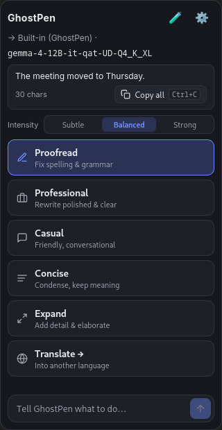
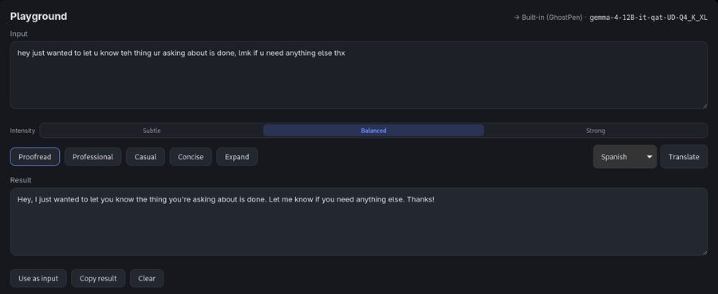
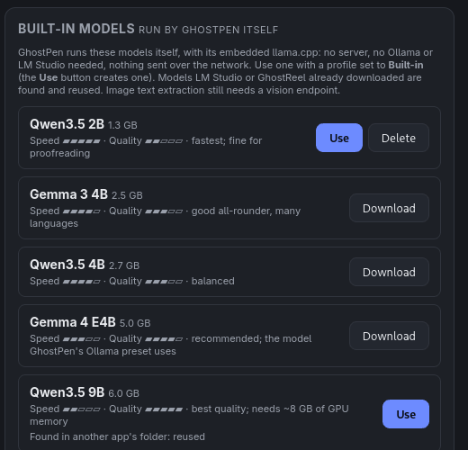
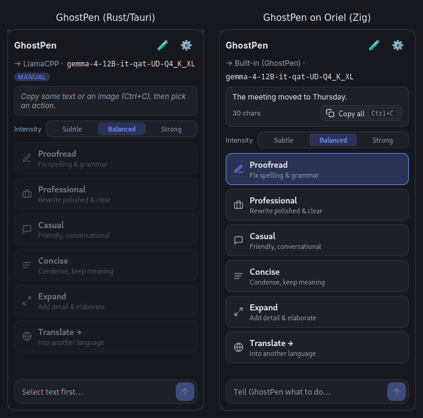

# GhostPen on Oriel

**[Website and downloads](https://highercomve.github.io/GhostPen/)** · [Releases](https://github.com/highercomve/GhostPen/releases) · The earlier Rust/Tauri version: [ghostpen-tauri](https://github.com/highercomve/ghostpen-tauri)

GhostPen, AI-driven text editing anywhere on your desktop, ported from Tauri
(Rust) to [Oriel](https://github.com/highercomve/Oriel) (Zig): the first full
application built on Oriel, using only its public `oriel` CLI and API.

Highlight text in any app, press the hotkey (or click the tray icon), pick an
action (proofread, rewrite, translate, …); the result is pasted back in
place. Also: a Playground with streaming answers, text extraction from
clipboard images (OCR through a vision model), live captions of system audio,
and voice dictation. Any OpenAI-compatible endpoint works (Ollama, LM
Studio, OpenAI, OpenRouter, Groq, …; the default is a local Ollama with
`gemma4:e4b`), or GhostPen runs a downloaded model itself: see
[Built-in models](#built-in-models).

**Downloads** ([website](https://highercomve.github.io/GhostPen/#download),
[releases](https://github.com/highercomve/GhostPen/releases)). The
AppImage, the Windows installer and the macOS app update themselves
(Settings → About & updates); deb and rpm installs say when a new version is out.

| | Package | Whisper and Built-in models run on |
| --- | --- | --- |
| Linux | AppImage, .deb, .rpm | any GPU through **Vulkan** (NVIDIA, AMD, Intel); the CPU without one |
| Linux, `-cuda` | AppImage, .deb, .rpm | NVIDIA GPUs through **CUDA** (RTX 20xx–50xx; needs the CUDA 13 runtime), else Vulkan |
| Windows 10/11 | setup.exe (per user) | any GPU through **Vulkan** (NVIDIA, AMD, Intel); the CPU without one |
| macOS 13+ | .dmg (Apple Silicon) | the GPU through **Metal** |

The React frontend is GhostPen's own; the commands, events and settings keep
the Tauri version's names and JSON shapes. On first run the Tauri app's
settings are imported, and its downloaded whisper models are reused.



| Playground | Settings → Built-in models |
| --- | --- |
|  |  |

## Build and run

```sh
oriel doctor --fix      # toolchain: Zig, Node.js, ...
oriel dev               # run with hot reload
oriel build             # zig-out/bin/ghostpen (+ ghostpen-cli)
oriel build -Dcuda      # whisper on an NVIDIA GPU (CUDA toolkit)
oriel build -Dvulkan    # ... or on any GPU through Vulkan (Linux and Windows releases; Windows needs the Vulkan SDK)
oriel package           # deb, rpm, AppImage / setup.exe / .app + .dmg
```

## Using it

| | |
| --- | --- |
| `Ctrl+Shift+A` | Menu for the selected text (hotkeys are editable in Settings) |
| `Ctrl+Shift+D` | Dictation: speak, ⏎ to finish (copied to the clipboard) |
| `Ctrl+Shift+L` | Live captions of what your computer plays |
| Tray icon | Menu, Dictation, Captions, Playground, Settings, Quit |

The same actions from a terminal or a desktop keybinding, handed to the
running instance: `ghostpen --trigger | --voice-input | --captions |
--settings | --playground`. On Wayland without the GlobalShortcuts portal,
bind these in your compositor, e.g. Hyprland:

```
bind = CTRL SHIFT, A, exec, ghostpen --trigger
```

`ghostpen-cli` runs an action from the terminal with the same settings:

```sh
echo "teh quick brown fox" | ghostpen-cli proofread
ghostpen-cli translate --lang French --stream "Good morning"
ghostpen-cli profiles
```

## Built-in models

A profile set to **Built-in** runs the model inside GhostPen itself, with the
llama.cpp compiled into it: no Ollama, LM Studio or other server, and
nothing sent over the network. In Settings → Built-in models:

- **Download** one of the catalog models (Qwen3.5 2B/4B/9B, Gemma 3 4B,
  Gemma 4 E4B) from Hugging Face. Downloads can be paused and resumed, and
  are checked against the SHA-256 Hugging Face publishes. They go to
  `<data dir>/GhostPen/models` (`~/.local/share/GhostPen/models` on Linux).
- GGUF files that **LM Studio** (`~/.lmstudio/models`) or **GhostReel**
  (`~/.ghostreel/models`) already downloaded are found and reused, catalog
  or not.
- **Use** points the "Built-in (GhostPen)" profile at a model (creating the
  profile if needed) and makes it active.
- Runner settings: the context window, the GPU (as many layers as its free
  memory holds; the rest runs on the CPU) and how long the model stays
  loaded between actions (10 minutes by default).

The model runs in a helper process (`ghostpen --llm-helper`, started
and stopped by GhostPen), so a crash or running out of memory can't take
the app down. The Linux and Windows releases run it on the GPU through Vulkan (any
vendor; the CPU without a Vulkan driver), and the `-cuda` releases through
CUDA on NVIDIA GPUs when the CUDA 13 runtime is installed (Vulkan
otherwise); build with `-Dcuda` for CUDA; macOS uses Metal. `ghostpen-cli` uses Built-in profiles too (`ghostpen-cli models`
lists them). Extract Text (reading an image's text) works on built-in models
that have their image projector, llama.cpp's `mmproj`: every catalog model has
one, downloaded with the model ("Add image support" for a model you already
have), and LM Studio's `mmproj-*.gguf` next to a model is picked up. Those
models show **reads images** in Settings.

Built-in profiles are new to this port: the Tauri app, if it reads the same
settings, sees them as endpoints with no URL.

## GPU backends: CUDA, Vulkan, CPU

Measured on an RTX 4070 with an AMD Ryzen 7 7800X3D 8-Core Processor, GhostPen 0.2.4 built with the
same CPU target, warm runs:

| | CUDA | Vulkan | CPU |
|---|---|---|---|
| Whisper small, 66 s of speech | 0.52 s | 0.60 s | 4.75 s |
| Qwen3.5 2B: prompt (1,390 tokens) | 12,858 tok/s | 10,571 tok/s | 193 tok/s |
| Qwen3.5 2B: generation | 216 tok/s | 195 tok/s | 36 tok/s |
| Ornith 1.5 9B Q4_K_M: prompt | 3,631 tok/s | 3,068 tok/s | |
| Ornith 1.5 9B Q4_K_M: generation | 74.9 tok/s | 69.6 tok/s | |

Vulkan's first transcription after start also compiles its pipelines
(1.5 s instead of 0.6 s).

## Compared with the Rust (Tauri) GhostPen

The same app on both stacks: GhostPen's React frontend, the same commands,
settings and prompts. Measured on 2026-09-27 on one Linux machine (Ryzen 7
7800X3D, 16 threads, RTX 4070; Arch Linux, Hyprland) with Zig 0.16.0 and
Rust 1.98.1: GhostPen 0.2.9 on Oriel 0.6.13, and the Tauri version at
`ab0c1c4` (0.1.3), both built for release with whisper on the GPU (CUDA).



On this Wayland desktop the Rust version runs in manual mode (no synthetic
Ctrl+C, so the menu asks you to copy first; in this test it didn't pick up a
manual copy either, and its Playground stopped responding). The Oriel
version copies the selection and pastes the result itself.

**Building**

| | Rust / Tauri 2 | Zig / Oriel |
| --- | --- | --- |
| Code (app + frontend, generated files excluded) | 8,086 lines (4,851 Rust, 2,227 TS, 1,008 CSS) | 10,191 lines (6,151 Zig, 3,108 TS, 932 CSS), with Built-in models, voice activity detection, draggable overlays |
| Dependencies | 627 crates (Cargo.lock) | 2 packages (Oriel, zigimg); Oriel itself has 9 |
| Clean build, app and CLI, CUDA ¹ | 298 s | 333 s |
| Clean build, app and CLI, CPU only ¹ | 167 s | 258 s |
| Rebuild, nothing changed ² | 49 s | 0.9 s |
| Rebuild after a one-line edit ³ | 48 s | 93 s |
| Packages (deb, rpm, AppImage), after a build | 149 s | 25 s |
| Build cache (CUDA build) | 4.4 GB `target/` + 1.8 GB `~/.cargo/registry` (shared by all Rust projects) | 1.4 GB (`.zig-cache` 1.2 GB + global 164 MB) + 259 MB sources (`zig-pkg/`) |

**Shipping**

| | Rust / Tauri 2 | Zig / Oriel |
| --- | --- | --- |
| App binary, stripped | 49.4 MB (whisper and its CUDA kernels inside) | 11.0 MB (whisper **and** llama.cpp) + 38.3 MB `libggml-cuda.so` |
| CLI binary, stripped | 7.8 MB | 1.5 MB |
| `.deb` / `.rpm` | 30.3 MB / 30.3 MB (app and CLI, unstripped: 62 + 11 MB) | 24.0 MB / 24.6 MB (app, CLI and `libggml-cuda.so`, stripped) |
| AppImage | 546 MB (bundles GTK 3, WebKitGTK and 190 more libraries) | 25.1 MB (uses the system's WebKitGTK 6.0) |
| Toolkit (Linux) | GTK 3, WebKitGTK 4.1 | GTK 4, WebKitGTK 6.0 |

**Running** ⁴

| | Rust / Tauri 2 | Zig / Oriel |
| --- | --- | --- |
| Start → Settings window shown ⁵ | 236 ms | 354 ms |
| Idle memory, 20 s after start (PSS, app + WebKit processes) | 619 MB (app 236 MB) | 632 MB (app 279 MB) |
| Memory with the whisper model loaded ⁶ | 913 MB (app 522 MB) | 925 MB (app 558 MB) |
| Idle CPU over 30 s | 0.05 s | 0.01 s |
| Transcribing a 6.1 s clip (large-v3-turbo q5_0, CUDA) ⁷ | 0.41 s (first request 0.62 s) | 0.24 s (first request 0.34 s) |
| Web content sandboxed | no (WebKitGTK 4.1 default) | yes (bubblewrap, WebKitGTK 6.0) |
| Synthetic copy/paste on Wayland | no (manual mode) | yes (virtual keyboard) |
| Runs AI models itself | no (an endpoint: Ollama, LM Studio, …) | yes: [Built-in models](#built-in-models), or an endpoint |

¹ Fresh clones and empty build caches (Zig's global cache too), dependency
sources downloaded beforehand (npm, the Cargo registry, `zig-pkg/`). Rust:
`tauri build --no-bundle` with `captions-cuda` (or `captions`), then
`cargo build --release --features cli --bin ghostpen-cli`; Oriel:
`oriel build -Dcuda` (or plain `oriel build`). Both include the frontend and
whisper.cpp; the Oriel build also compiles llama.cpp for Built-in models,
and a debug build that refreshes the frontend's TypeScript bindings. The
CUDA kernels add 131 s to the Rust build and 75 s to the Oriel one.
² The same command again. `tauri build` rebuilds the frontend, which makes
the app crate recompile, and the CLI (another feature set) recompiles it
once more; `cargo build` alone after that still took 29 s. Zig caches by
content, so nothing is recompiled.
³ A string in a log line of the app's main source file. Zig compiles the
whole app as one unit, so an edit costs the full app compile; Rust
recompiles only the app crate (twice, as in ²).
⁴ On a private X display (Xvfb) with a private D-Bus session, the same for
both. Both create their five web views at startup.
⁵ From exec until the "GhostPen Settings" window is mapped (`--settings`),
median of 5 runs after a warm-up. Of Oriel's extra ~120 ms, about 40 ms is
WebKitGTK 6.0's process sandbox and about 40 ms is loading the CUDA backend
at startup (the Rust version initializes CUDA with the first model load).
⁶ With the transcription server (`GHOSTPEN_STT_SERVER=1`) after four
requests.
⁷ `tests/speech.wav` through the transcription server, the same model and
the same text back; the time is the HTTP round trip, median of the warm
requests. Oriel's whisper.cpp (1.9.4) skips the clip's silence with its
voice activity detection; the Rust version uses whisper-rs 0.15.

## Transcription server for other tools

`GHOSTPEN_STT_SERVER=1 ghostpen` also serves the whisper model as an
OpenAI-compatible API, so local tools (an agent that receives voice notes,
a video indexer) transcribe through GhostPen's model instead of loading
another: `POST /v1/audio/transcriptions` (multipart `file`, any format
`ffmpeg` reads; `language`; `response_format` json, text, verbose_json with
timestamped segments, srt or vtt), `GET /v1/models`, `GET /health`. It
binds `GHOSTPEN_STT_BIND` (default `0.0.0.0:8771`), serves Settings → Live
Captions' model or `GHOSTPEN_STT_MODEL`, and shares it with captions and
dictation (one copy in memory). Needs `ffmpeg`.

## Updates

Settings → About & updates shows the version, checks for a new release and,
with "Update automatically" on (the default), checks a minute after start
and every 12 hours. The Windows installer, the AppImage and the macOS app
update themselves (the new version starts on the next launch, or with
"Restart now"); deb/rpm installs and source builds only say a new version
exists. Each release publishes a `latest.json` signed with Ed25519 (the
`GHOSTPEN_UPDATE_KEY` secret); GhostPen installs only what matches the public
key in `build.zig`. `GHOSTPEN_UPDATE_MANIFEST=<https url>` checks another
manifest, e.g. to try a release before publishing it.

## Permissions

Declared with `oriel permission add` (see `build.zig`): accessibility
(synthetic copy/paste into other apps; macOS asks on first run), microphone
(dictation) and system audio (captions). On macOS, captions need a loopback
device such as BlackHole.

## Tests

```sh
zig build test            # AI client, settings, images, models
tests/e2e.sh              # headless: select → trigger → Proofread → pasted; Playground streaming
tests/e2e-audio.sh        # headless: captions overlay, dictation → proofread → clipboard
```

The end-to-end tests run on a private X display (Xvfb + D-Bus) against a mock
AI endpoint (`tests/mock_openai.py`); the audio test feeds `tests/speech.wav`
instead of the sound server (`$GHOSTPEN_TEST_AUDIO`).

## Layout

| File | |
| --- | --- |
| `src/main.zig` | Commands, events, the menu flow, windows, tray, hotkeys, launch flags |
| `src/ai.zig` | OpenAI-compatible client: prompts, reasoning-leak retry, SSE streaming, vision, `/models`; local profiles go to `local_llm.zig` |
| `src/local_llm.zig`, `src/llm_helper.zig` | Built-in models: the runner's client (start, idle unload, cancel) and the runner (llama.cpp, JSON lines) |
| `src/llm_models.zig`, `src/chat_format.zig` | Model catalog, resumable verified downloads, models found on disk; prompt formats (Gemma 4/3, ChatML, Qwen thinking) |
| `src/settings.zig`, `src/store.zig` | Settings schema (Tauri-compatible) and the Oriel store |
| `src/captions.zig`, `src/dictation.zig`, `src/models.zig` | Whisper captions and dictation, one shared model |
| `src/image.zig` | PNG helpers for OCR and previews |
| `src/cli.zig` | `ghostpen-cli` |
| `frontend/` | GhostPen's React UI (`src/api.ts` over Oriel's `invoke`/`listen`) |

## License

MIT: see [LICENSE](LICENSE).
